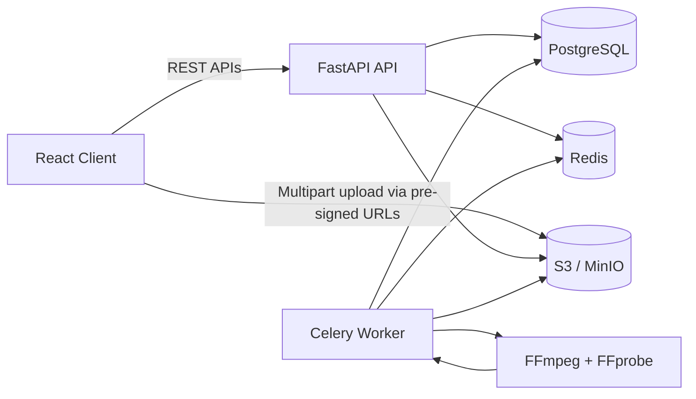

# VideoN

A production-oriented full-stack application for uploading large videos, annotating them by timestamp or frame, generating interval-based review slots, and producing summaries from the collected notes.

## Stack

- Frontend: React + TypeScript + Vite + React Query
- Backend: FastAPI + SQLAlchemy + Celery
- Database: PostgreSQL
- Object storage: S3-compatible storage (MinIO locally, AWS S3 or equivalent in production)
- Background jobs: Redis + Celery worker
- Media processing: FFmpeg / FFprobe

## Why These Choices

- Direct multipart uploads to object storage keep multi-GB files away from the FastAPI process, which is the most important scalability decision in the system.
- PostgreSQL fits structured metadata and relational annotation queries without introducing operational complexity.
- Celery + Redis keeps video processing, metadata extraction, poster generation, and remote imports off the request path.
- S3-compatible storage lets local development use MinIO while production can swap to S3, R2, DigitalOcean Spaces, or similar without code changes.
- The summary logic is intentionally isolated in a service so a rule-based summary can ship immediately and an LLM-backed version can be added later without reshaping the API.

## Features

- Multipart local uploads for very large videos
- Public URL ingestion for remotely hosted videos
- Background metadata extraction with FFprobe
- Poster generation with FFmpeg
- Video library with processing state, duration, and size
- Detail page with playback, seek controls, and annotation timeline markers
- Timestamp-based and frame-based annotations
- Interval slot generation at 1s, 5s, 10s, or 30s
- LLM-backed summary generation with rule-based fallback when no provider key is configured

## Architecture



## Local Setup

### Prerequisites

- Docker and Docker Compose

### Run Everything

1. Start the full stack:

   ```bash
   docker compose up --build
   ```

2. Open the app:

   ```text
   Frontend: http://localhost:5173
   API docs: http://localhost:8000/docs
   MinIO console: http://localhost:9001
   ```

3. Log into MinIO with:

   ```text
   Access key: minioadmin
   Secret key: minioadmin
   ```

### Environment Files

- `backend/.env.example`
- `frontend/.env.example`

For local Docker usage, the compose file already injects the required values.

Optional for LLM summaries:

- `OPENAI_API_KEY`
- `OPENAI_SUMMARY_MODEL` default: `gpt-4.1-nano`

Useful production-oriented settings:

- `ENVIRONMENT=production`
- `LOG_LEVEL=INFO`
- `DATABASE_POOL_SIZE`, `DATABASE_MAX_OVERFLOW`, `DATABASE_POOL_TIMEOUT_SECONDS`
- `S3_CREATE_BUCKET_ON_STARTUP=false` for managed object storage
- `HTTP_RETRY_MAX_ATTEMPTS` for remote URL imports
- `FFMPEG_TIMEOUT_SECONDS`, `FFPROBE_TIMEOUT_SECONDS`

## Core API Surface

- `GET /api/health`: liveness check
- `GET /api/health/ready`: readiness check for database, Redis, and storage
- `POST /api/videos/uploads/initiate`: start multipart upload
- `POST /api/videos/{video_id}/uploads/part-url`: fetch pre-signed part upload URL
- `POST /api/videos/{video_id}/uploads/complete`: finalize upload and queue processing
- `POST /api/videos/import-url`: ingest a video from a public URL
- `GET /api/videos`: list videos
- `GET /api/videos/{video_id}`: fetch detail + annotations + playback URL
- `POST /api/videos/{video_id}/annotations`: create timestamp or frame annotation
- `PATCH /api/annotations/{annotation_id}`: update note text
- `POST /api/videos/{video_id}/annotations/intervals`: generate interval slots
- `POST /api/videos/{video_id}/summary`: generate a summary from annotations

## Deployment Notes

The repo includes `deploy/render.yaml` as a deployment starting point for Render, plus Dockerfiles for both the API and frontend.

Production hardening included in this repo:

- API readiness endpoint that verifies database, Redis, and object storage wiring before traffic is accepted
- Non-root Docker containers for the API and frontend
- Request logging with request IDs and response timing headers
- Tuned SQLAlchemy connection pooling for PostgreSQL
- S3 client retries and connection pool tuning
- Celery safety defaults such as late acknowledgements and low prefetch
- Retry/backoff for transient remote import failures

Recommended production topology:

- Frontend on Vercel or Render Static
- API and worker on Render, Railway, or AWS ECS
- PostgreSQL on Render Postgres, Railway Postgres, or AWS RDS
- Redis on Render Redis, Railway Redis, or ElastiCache
- Object storage on AWS S3, Cloudflare R2, or DigitalOcean Spaces

### Required Production Configuration

- Point `S3_ENDPOINT_URL` and `S3_PUBLIC_ENDPOINT_URL` to your public object storage endpoint.
- Add S3 bucket CORS that allows `PUT`, `GET`, `POST`, and exposes the `ETag` header.
- Set `CORS_ORIGINS` to your deployed frontend origin.
- Run both the FastAPI API service and the Celery worker service.

## Tradeoffs

- The player uses native browser playback for simplicity and reliability. If you need adaptive bitrate streaming or broader codec normalization, add an HLS packaging step in the worker.
- Database migrations were kept lightweight for this exercise by creating tables on startup. In a long-lived production repo, Alembic would be the next improvement.
- Summary generation now supports an OpenAI-backed path for more intelligent synthesis. If `OPENAI_API_KEY` is not configured, the app falls back to a deterministic rule-based summary so the workflow still works locally.

## Deliverables Status

- Complete repository: included in this workspace
- Public deployment URL: not included from this environment because no cloud deployment credentials are available here
- README with setup, architecture, and design decisions: included
